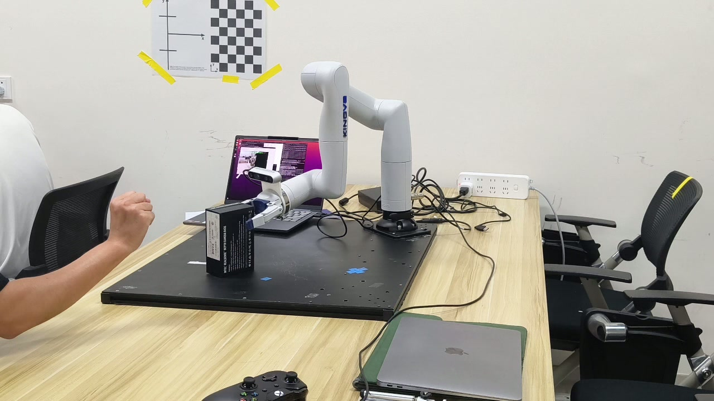
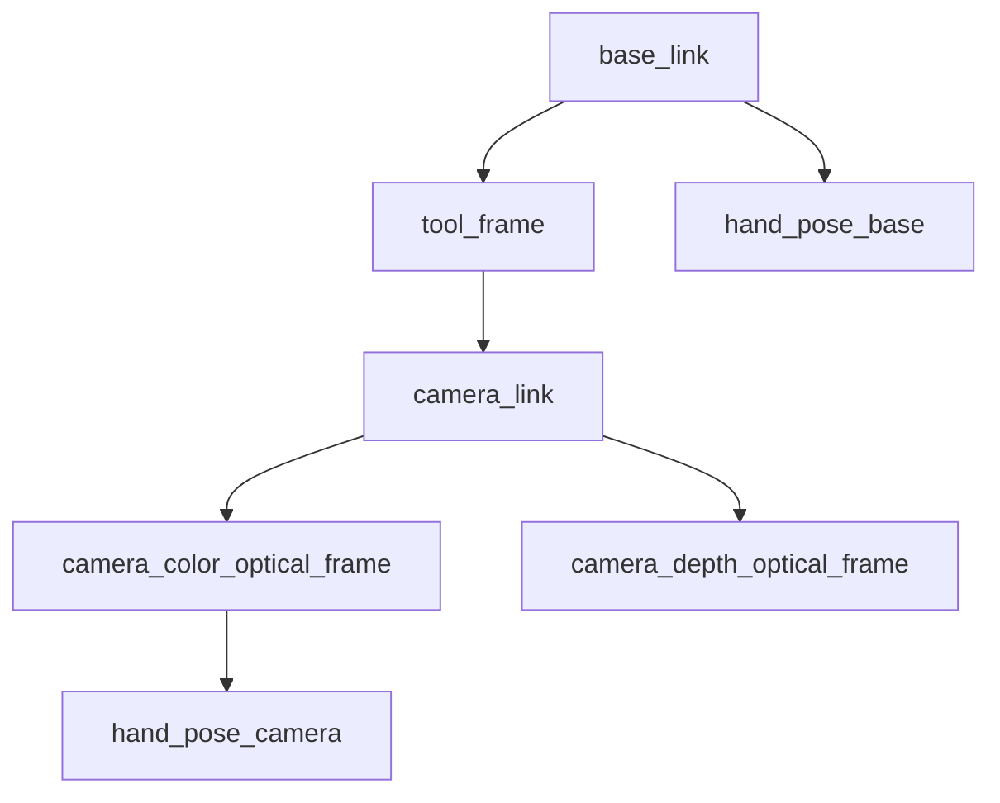
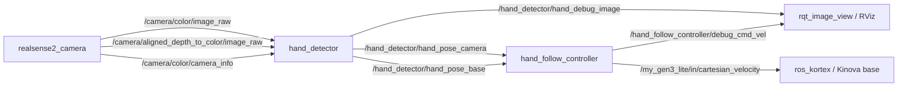

# Gen3 Lite + RealSense D435 Eye-in-Hand Hand Following

<div align="center">
  <a href="实操演示.mp4" target="_blank">
    
  </a>
  <p><em>👆 点击图片播放演示视频</em></p>
</div>

这是一个 ROS Noetic / Python3 项目包，用于 Kinova Gen3 Lite 末端安装 RealSense D435 的「人手跟随」实验。核心链路是：

`RGB 手部检测 -> aligned depth 取深度 -> 反投影到 camera optical frame -> TF 到 base_link -> 速度型视觉伺服 -> Kinova Cartesian velocity`

默认 launch 使用 `dry_run:=true`，只发布调试速度，不直接驱动机械臂。第一次实机请保持 dry run，确认 TF、方向、工作空间和急停都没问题后再切到 `dry_run:=false`。

## 1. 推荐算法与功能包选型

手部检测：

- 推荐：`MediaPipe Hands`。优点是轻量、实时、对普通 RGB 图像鲁棒。
- 3D 提取：使用 RealSense `aligned_depth_to_color/image_raw` + `/camera/color/camera_info`，对手掌多个关键点附近深度取中值，比单点深度更稳。
- 不建议首版直接从 PointCloud2 分割手：点云可用于后续增强，但调试复杂度更高，延迟和噪声也更难控。

滤波：

- 检测端：3D hand position 使用 One Euro Filter，兼顾低延迟和去抖。
- 控制端：速度命令使用低通滤波 + 加速度限制 + 死区。
- 延迟补偿：根据 `hand_pose_base` 差分估计手速，加入速度前馈和小量预测误差。

控制策略：

- 默认使用 eye-in-hand 视觉伺服，不把末端直接移动到手的位置，而是让手在相机画面中心、保持 `desired_hand_distance_m`。
- 速度命令发到 Kinova Kortex `/my_gen3_lite/in/cartesian_velocity`。
- 姿态默认不控制，角速度为 0。实机稳定后可扩展为保持相机朝向手心。

## 2. 系统架构

TF 树建议如下：



Node / Topic 关系：



## 3. 坐标变换流程

使用 aligned depth 时，像素坐标和深度图已经对齐到 color camera：

1. MediaPipe 在 RGB 图像中得到手部关键点 `(u, v)`。
2. 在 aligned depth 的 `(u, v)` 附近窗口取有效深度中值 `Z`。
3. 用 CameraInfo 内参反投影到 `camera_color_optical_frame`：

   ```python
   X = (u - cx) * Z / fx
   Y = (v - cy) * Z / fy
   Z = Z
   ```

4. 发布 `PoseStamped(frame_id=camera_color_optical_frame)`。
5. 用 TF 转换到 `base_link`：

   ```python
   base_pose = tf_buffer.transform(camera_pose, "base_link", timeout=rospy.Duration(0.03))
   ```

从你提供的 `frames.pdf` 看，当前 TF 树里已经有这条链路：

```text
base_link
  -> shoulder_link
  -> half_arm_1_link
  -> half_arm_2_link
  -> forearm_link
  -> spherical_wrist_1_link
  -> spherical_wrist_2_link
  -> bracelet_link
  -> end_effector_link
      -> camera_link
          -> camera_color_frame
          -> camera_depth_frame
              -> camera_depth_optical_frame
          -> camera_aligned_depth_to_color_frame
              -> camera_color_optical_frame
      -> tool_frame
```

你的机器人 ROS namespace 是 `my_gen3`，因此默认速度 topic 已设为：

```text
/my_gen3/in/cartesian_velocity
```

如果你信任当前 URDF/robot_state_publisher 里的 `end_effector_link -> camera_link`，可以直接用普通 launch，并保持 `camera_frame:=camera_color_optical_frame`。

如果你想强制使用 retry3 手眼标定结果，则使用 `hand_follow_retry3.launch`。这个 launch 不覆盖 RealSense 自带 TF，而是额外发布虚拟 frame：`end_effector_link -> handeye_camera_color_optical_frame`。

你这次提供的 retry3 标定文件已经放入：

- [config/handeye_tool_camera_retry3.json](config/handeye_tool_camera_retry3.json)

其中结果是：

```text
parent: end_effector_link
child:  camera_color_optical_frame
xyz:    0.08527739082893107 -0.07086621603976238 0.22382300230315322
qxyzw:  -0.02818366984721186 -0.2042331373489352 0.43376901963502806 0.877119686227268
```

因为 RealSense 可能已经发布 `camera_link -> camera_color_optical_frame`，直接再发布 `end_effector_link -> camera_color_optical_frame` 可能造成 TF 多父节点冲突。本包额外提供了 [launch/hand_follow_retry3.launch](launch/hand_follow_retry3.launch)，它会发布一个虚拟光学坐标系：

```text
end_effector_link -> handeye_camera_color_optical_frame
```

检测节点会把 RGB/depth 反投影得到的点标记到这个虚拟 frame 下，从而使用你的标定结果，同时避免和 RealSense 自带 TF 打架。

如果你仍想手动发布静态 TF，可在 launch 中设置：

```bash
roslaunch gen3_lite_hand_follow hand_follow.launch \
  publish_handeye_tf:=true \
  handeye_parent_frame:=end_effector_link \
  handeye_child_frame:=handeye_camera_color_optical_frame \
  camera_frame:=handeye_camera_color_optical_frame \
  handeye_xyz_quat:="x y z qx qy qz qw"
```

这里的 `x y z qx qy qz qw` 必须替换成你的实际标定结果，表示 `parent -> child`。如果你的标定结果是 `camera -> tool`，需要先求逆再填入。

retry3 文件里还有一个需要特别注意的质量指标：

```text
target_translation_error_mean_m: 0.1097
target_rotation_error_mean_deg: 71.80
```

这个一致性误差偏大。代码可以使用这组外参，但实机前建议先用 RViz 验证：手在相机前方左右/上下移动时，`/hand_detector/hand_pose_base` 的方向必须符合真实空间；如果方向反、尺度怪或跳变明显，请先重新做手眼标定。

## 4. 手部检测到 3D 坐标 Pipeline

代码位置：[scripts/hand_detector_node.py](scripts/hand_detector_node.py)

流程：

1. 订阅 RGB 和 aligned depth，并用 `ApproximateTimeSynchronizer` 做时间同步。
2. MediaPipe 检测 21 个手部关键点。
3. 默认取 `[0, 5, 9, 13, 17]`，即 wrist 与四个 MCP 关节。
4. 每个关键点在 `depth_window_px` 窗口内取深度中值。
5. 多个 3D 点再取中值，得到手掌中心的稳定估计。
6. One Euro Filter 输出平滑后的 `hand_pose_camera`。
7. TF 转换并发布 `hand_pose_base`。

输出：

- `/hand_detector/hand_pose_camera`
- `/hand_detector/hand_pose_base`
- `/hand_detector/hand_valid`
- `/hand_detector/hand_marker`
- `/hand_detector/hand_debug_image`

## 5. 平滑跟随控制策略

代码位置：[scripts/hand_follow_controller_node.py](scripts/hand_follow_controller_node.py)

默认控制目标不是“末端撞向手”，而是让手保持在相机坐标：

```text
x = desired_hand_camera_x
y = desired_hand_camera_y
z = desired_hand_distance_m
```

控制律：

```text
error_camera = hand_camera - desired_hand_camera
error_base = R_base_camera * error_camera
v = kp * (error_base + latency_comp_s * hand_velocity_base)
    + feedforward_gain * hand_velocity_base
v = deadband(v)
v = clamp_norm(v, max_linear_speed_mps)
v = lowpass(v)
v = acceleration_limit(v, max_linear_accel_mps2)
```

安全逻辑：

- `target_timeout_s` 内没有新目标就发零速度。
- `workspace_min_xyz / workspace_max_xyz` 限制 `tool_frame` 的 base-frame 工作空间。
- 关机回调连续发送零速度。
- 默认 `dry_run:=true`，必须手动改成 false 才会发 Kinova 命令。

## 6. 安装与运行

假设你已有：

- Ubuntu 20.04
- ROS Noetic
- `ros_kortex_noetic_devel`
- `realsense-ros`
- D435 可正常发布 RGB / Depth / TF

安装依赖：

```bash
sudo apt update
sudo apt install -y \
  ros-noetic-cv-bridge \
  ros-noetic-image-transport \
  ros-noetic-tf2-ros \
  ros-noetic-tf2-geometry-msgs \
  ros-noetic-rqt-image-view \
  python3-pip

pip3 install -r ~/catkin_ws/src/gen3_lite_hand_follow/requirements.txt
```

放入 catkin 工作区：

```bash
cd ~/catkin_ws/src
# 将本包 gen3_lite_hand_follow 放到这里
chmod +x gen3_lite_hand_follow/scripts/*.py
cd ~/catkin_ws
catkin_make
source devel/setup.bash
```

启动 RealSense，务必开启 depth 对齐：

```bash
roslaunch realsense2_camera rs_camera.launch align_depth:=true
```

启动 Kinova Kortex 驱动，示例：

```bash
roslaunch kortex_driver kortex_driver.launch \
  arm:=gen3_lite \
  robot_name:=my_gen3 \
  dof:=6
```

先 dry run：

```bash
roslaunch gen3_lite_hand_follow hand_follow.launch \
  robot_name:=my_gen3 \
  base_frame:=base_link \
  tool_frame:=end_effector_link \
  camera_frame:=camera_color_optical_frame \
  dry_run:=true
```

如果使用你提供的 retry3 标定结果，推荐直接启动：

```bash
roslaunch gen3_lite_hand_follow hand_follow_retry3.launch \
  robot_name:=my_gen3 \
  dry_run:=true
```

查看结果：

```bash
rostopic echo /hand_detector/hand_pose_base
rostopic echo /hand_follow_controller/debug_cmd_vel
rqt_image_view /hand_detector/hand_debug_image
rosrun tf view_frames
```

确认方向正确、速度平滑、工作空间合理后，再低速实机：

```bash
roslaunch gen3_lite_hand_follow hand_follow.launch \
  robot_name:=my_gen3_lite \
  dry_run:=false
```

## 7. 必须按实机调整的参数

在 [config/hand_follow.yaml](config/hand_follow.yaml) 中重点改：

- `robot_name`：你的 Kortex namespace。从你提供的 TF 树看是 `my_gen3`。
- `base_frame` / `tool_frame` / `camera_frame`：必须和 TF 树一致。retry3 标定默认 `base_link`、`end_effector_link`、`handeye_camera_color_optical_frame`。
- `cartesian_velocity_topic`：通常是 `/<robot_name>/in/cartesian_velocity`，你的配置对应 `/my_gen3/in/cartesian_velocity`。
- `kortex_reference_frame`：Kortex 笛卡尔速度参考系。通常 `BASE=3`，可用 `rosmsg show kortex_driver/CartesianReferenceFrame` 确认。
- `desired_hand_distance_m`：建议先 `0.45-0.60 m`，太近容易撞手。
- `workspace_min_xyz` / `workspace_max_xyz`：按桌面、机械臂安装位置、人体区域设置。
- `max_linear_speed_mps`：首次实机建议 `0.05-0.08`，稳定后再到 `0.12-0.18`。
- `max_linear_accel_mps2`：越小越柔，但响应会慢。
- `kp`：跟随刚度，先小后大。
- `one_euro_min_cutoff` / `one_euro_beta`：检测端平滑与延迟的折中。
- `handeye_xyz_quat`：如果 launch 发布手眼 TF，必须填你的真实标定。retry3 已填入 `0.08527739082893107 -0.07086621603976238 0.22382300230315322 -0.02818366984721186 -0.2042331373489352 0.43376901963502806 0.877119686227268`。

## 8. 调参顺序

1. 静态 TF：
   - 使用 retry3 launch 时运行：`rosrun tf tf_echo base_link handeye_camera_color_optical_frame`
   - 使用已有 RealSense TF 链时运行：`rosrun tf tf_echo base_link camera_color_optical_frame`
   - 移动机械臂时相机 TF 应跟着末端走。

2. 深度与手部检测：
   - 手放在画面中心，看 `/hand_detector/hand_debug_image`。
   - 看 `/hand_detector/hand_pose_camera` 的 z 是否接近真实距离。

3. base 坐标方向：
   - 手向机器人 base 的 +X/+Y/+Z 方向移动，确认 `/hand_detector/hand_pose_base` 变化方向正确。

4. dry run 控制方向：
   - 看 `/hand_follow_controller/debug_cmd_vel`。
   - 手在画面右侧时，速度方向应让相机把手带回中心。

5. 低速实机：
   - `max_linear_speed_mps=0.05`
   - `kp=0.35`
   - `feedforward_gain=0.0`
   - 确认无反向、无突跳后逐步增加。

6. 顺滑性：
   - 先调 `max_linear_accel_mps2`，控制启停柔和度。
   - 再调 `command_lpf_alpha`，越小越平滑但越滞后。
   - 再加 `feedforward_gain=0.15-0.35` 减小滞后。
   - 最后微调 One Euro Filter。

## 9. 常见问题排查

没有 `hand_pose_base`：

- 检查 TF 是否存在：`base_link -> ... -> camera_color_optical_frame`。
- 检查 `camera_frame` 是否和 CameraInfo 的 `header.frame_id` 一致。
- 如果只有 `camera_link -> tool_frame` 标定，launch 中需要发布逆变换 `tool_frame -> camera_link`。
- 如果 `/hand_detector/hand_pose_camera` 有输出但 `/hand_detector/hand_pose_base` 没输出，通常是 TF 时间戳 extrapolation。默认 `use_latest_tf_for_base: true` 会使用最新 TF 转换；如果你改成了 false，请先改回 true。

RGB 有手但没有深度：

- 确认 RealSense 使用 `align_depth:=true`。
- 确认 depth topic 是 `/camera/aligned_depth_to_color/image_raw`。
- 把手放在 D435 前方约 `0.4-0.8 m`，太近或太远都可能没有有效深度。
- 增大 `depth_window_px` 到 `11` 或 `15`，或增大 `depth_fallback_window_px` 到 `51`。
- 检查 `min_depth_m / max_depth_m` 是否把手过滤掉了。
- 用 `rostopic echo -n 1 /camera/aligned_depth_to_color/image_raw/encoding` 确认深度图存在；常见编码是 `16UC1`。

机械臂抖动：

- 降低 `kp`。
- 降低 `max_linear_accel_mps2`。
- 降低 `command_lpf_alpha`，例如 `0.25`。
- 增大 `deadband_m`，例如 `0.025`。
- 提高光照质量，避免 MediaPipe 关键点跳变。

明显滞后：

- 增大 `one_euro_beta`，例如 `0.06-0.10`。
- 增大 `command_lpf_alpha`，例如 `0.45`。
- 增大 `feedforward_gain`，例如 `0.25-0.40`。
- 降低图像分辨率，提高 RealSense FPS。

速度方向反了：

- 先不要实机，保持 `dry_run:=true`。
- 检查 hand-eye TF 是否填反。
- 检查使用的是 `camera_color_optical_frame`，不是普通 `camera_link`。optical frame 是 x 右、y 下、z 前。

Kinova 不动：

- 确认 `dry_run:=false`。
- 确认 topic：`rostopic info /my_gen3/in/cartesian_velocity`。
- 确认 Kortex 驱动已进入可接收 twist command 的状态，没有 fault。
- 某些 Kortex 配置需要先 clear fault / activate notification / enable servoing，请按你当前 ros_kortex 示例流程启动。

## 10. 实机安全建议

- 先在空旷区域测试，不要让人手进入末端夹具、相机支架和桌面之间。
- 首次实机把 `max_linear_speed_mps` 设为 `0.05`。
- 保持 Kinova 实体急停或软件停止按钮随手可按。
- 使用 `workspace_min_xyz / workspace_max_xyz` 把机器人限制在桌面上方。
- 手部丢失、TF 丢失、检测超时都会停机；不要把这些保护关掉。
- 不建议首版控制姿态；位置跟随稳定后再考虑姿态。

## 11. 手势夹爪控制

新增功能：

- `/hand_detector/hand_gesture`：检测节点发布 `open`、`fist` 或 `unknown`。
- `/gesture_gripper/stable_gesture`：夹爪节点发布经过连续帧防抖后的稳定手势。
- 握拳 `fist`：调用 `/my_gen3/base/send_gripper_command` 闭合夹爪。
- 张开 `open`：调用 `/my_gen3/base/send_gripper_command` 松开夹爪。
- 手势夹爪节点和末端跟随控制节点是并行的，夹爪开合期间跟随仍继续运行。

先 dry run 检查手势：

```bash
roslaunch gen3_lite_hand_follow hand_follow_retry3.launch dry_run:=true
rostopic echo /hand_detector/hand_gesture
rostopic echo /gesture_gripper/stable_gesture
```

实机运行：

```bash
roslaunch gen3_lite_hand_follow hand_follow_retry3.launch dry_run:=false
```

关键参数在 `config/hand_follow.yaml`：

```yaml
hand_detector:
  enable_gesture: true
  open_finger_min_count: 3
  fist_finger_max_count: 1

gesture_gripper:
  service_name: /my_gen3/base/send_gripper_command
  open_value: 0.0
  close_value: 0.75
  debounce_count: 5
  min_command_interval_s: 1.0
```

如果夹爪不动，先检查：

```bash
rosservice list | grep send_gripper_command
rostopic echo /hand_detector/hand_gesture
rostopic echo /gesture_gripper/stable_gesture
```

如果握拳误触发，增大：

```yaml
debounce_count: 8
```

如果夹得太紧，降低：

```yaml
close_value: 0.60
```
